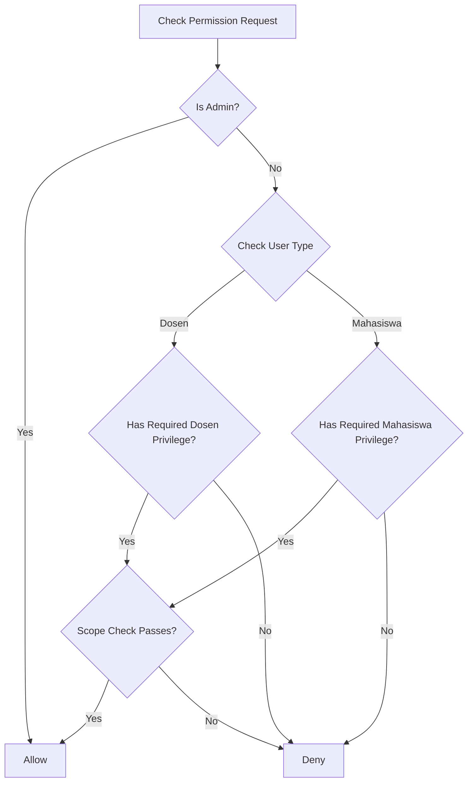
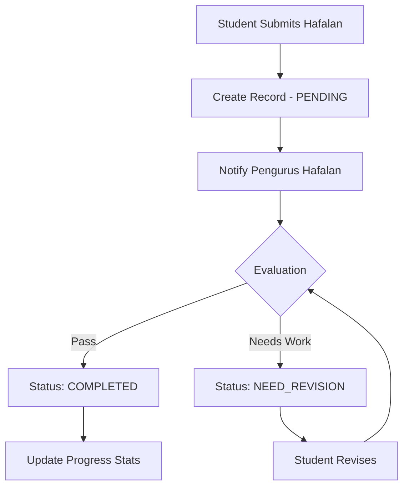
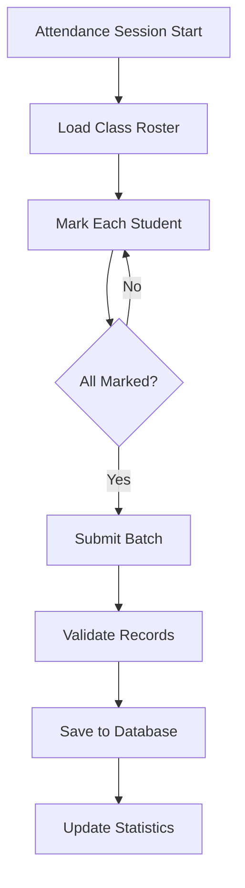

# ClassMe: Prisma Migration and Feature Enhancement Plan

## Executive Summary

This document outlines the comprehensive plan for migrating the ClassMe application from Drizzle ORM to Prisma ORM, along with implementing enhanced features including improved privilege management, hafalan tracking, and attendance systems.

---

## Table of Contents

1. [Current State Analysis](#current-state-analysis)
2. [Migration Scope](#migration-scope)
3. [Implementation Phases](#implementation-phases)
4. [Prisma Schema Design](#prisma-schema-design)
5. [File Migration Reference](#file-migration-reference)
6. [Feature Enhancements](#feature-enhancements)
7. [Risk Assessment](#risk-assessment)
8. [Testing Strategy](#testing-strategy)

---

## Current State Analysis

### Current Technology Stack
- **Framework**: Next.js 16.1.6 with App Router
- **Database**: PostgreSQL
- **Current ORM**: Drizzle ORM 0.45.1
- **Authentication**: JWT-based sessions with cookies
- **UI**: shadcn/ui components with Tailwind CSS

### Existing Database Schema (Drizzle)

The current schema includes 16 tables:

| Table | Purpose |
|-------|---------|
| users | User accounts with roles |
| academicYears | Academic year management |
| semesters | Semester periods |
| classes | Class/course definitions |
| classEnrollments | Student-class relationships |
| groups | Small groups within classes |
| groupMembers | Group membership |
| fanIlmu | Study areas - Fiqh, Hadits, etc. |
| dosenPrivileges | Dosen role assignments per class |
| mahasiswaPrivileges | Student role assignments per class |
| materials | Course materials |
| materialAchievements | Student progress on materials |
| hafalanRecords | Hafalan/memorization tracking |
| attendanceRecords | Attendance tracking |
| evaluations | Student evaluations |
| announcements | Class announcements |

### Existing Enums

```
userTypeEnum: admin, dosen, mahasiswa
semesterTypeEnum: ganjil, genap
enrollmentStatusEnum: active, inactive, graduated, dropped
dosenPrivilegeTypeEnum: dosen_pendamping, wali_kelas, pengurus_hafalan, pengurus_capaian_materi, pengurus_kelas
mahasiswaPrivilegeTypeEnum: ketua_umum, ketua_kelompok, kamtib, ketua_fan_ilmu, sekretaris, bendahara
hafalanStatusEnum: pending, in_progress, completed, need_revision
achievementStatusEnum: not_started, in_progress, completed
attendanceStatusEnum: present, absent, late, excused
evaluationTypeEnum: weekly, monthly, semester, special
materialTypeEnum: core, supplementary, assessment
```

---

## Migration Scope

### Files Requiring Modification

#### Core Database Files (Complete Replacement)
| File | Action |
|------|--------|
| `src/lib/db/index.ts` | Replace with Prisma client |
| `src/lib/db/schema.ts` | Remove - replaced by Prisma schema |
| `drizzle.config.ts` | Remove |

#### Server Actions (Query Migration)
| File | Drizzle Imports | Migration Complexity |
|------|-----------------|---------------------|
| `src/actions/auth.ts` | db, users, eq | Low |
| `src/actions/admin/users.ts` | db, users, eq | Medium |
| `src/actions/admin/classes.ts` | db, classes, classEnrollments, groups, fanIlmu, semesters, users, eq, and, count | High |
| `src/actions/admin/privileges.ts` | db, dosenPrivileges, mahasiswaPrivileges, users, groups, classEnrollments, eq, and | High |
| `src/actions/dosen/hafalan.ts` | db, hafalanRecords, classEnrollments, users, fanIlmu, eq, and, desc | High |
| `src/actions/ketua-umum/privileges.ts` | db, mahasiswaPrivileges, classEnrollments, groups, fanIlmu, eq, and | Medium |

#### Authentication/Permissions
| File | Drizzle Imports | Migration Complexity |
|------|-----------------|---------------------|
| `src/lib/auth/session.ts` | db, users, eq | Low |
| `src/lib/auth/permissions.ts` | db, dosenPrivileges, mahasiswaPrivileges, classEnrollments, eq, and | Medium |

#### Dashboard Pages
| File | Drizzle Imports | Migration Complexity |
|------|-----------------|---------------------|
| `src/app/(dashboard)/layout.tsx` | db, classEnrollments, eq, and | Low |
| `src/app/(dashboard)/admin/page.tsx` | db, users, classes, classEnrollments, semesters, eq, count, and | Medium |
| `src/app/(dashboard)/admin/classes/page.tsx` | db, semesters, eq | Low |
| `src/app/(dashboard)/admin/users/users-table.tsx` | User type from schema | Low |
| `src/app/(dashboard)/dosen/page.tsx` | db, dosenPrivileges, classes, classEnrollments, hafalanRecords, attendanceRecords, eq, count, and, sql | High |
| `src/app/(dashboard)/mahasiswa/page.tsx` | db, classEnrollments, classes, mahasiswaPrivileges, hafalanRecords, materialAchievements, attendanceRecords, announcements, eq, and, count, desc | High |

### Package Changes

#### Remove
```json
{
  "drizzle-orm": "^0.45.1",
  "drizzle-kit": "^0.31.8",
  "postgres": "^3.4.8"
}
```

#### Add
```json
{
  "@prisma/client": "^6.x",
  "prisma": "^6.x" // devDependency
}
```

---

## Implementation Phases

### Phase 1: Prisma Setup and Configuration

#### 1.1 Install Prisma
```bash
npm uninstall drizzle-orm drizzle-kit postgres
npm install @prisma/client
npm install -D prisma
```

#### 1.2 Initialize Prisma
```bash
npx prisma init
```

#### 1.3 Create Prisma Client Singleton
Create `src/lib/prisma.ts`:
```typescript
import { PrismaClient } from '@prisma/client';

declare global {
  var prisma: PrismaClient | undefined;
}

const prisma = global.prisma || new PrismaClient();

if (process.env.NODE_ENV === 'development') {
  global.prisma = prisma;
}

export default prisma;
```

#### 1.4 Update package.json scripts
```json
{
  "scripts": {
    "db:generate": "prisma generate",
    "db:push": "prisma db push",
    "db:migrate": "prisma migrate dev",
    "db:studio": "prisma studio",
    "db:seed": "prisma db seed"
  }
}
```

---

### Phase 2: Schema Migration

#### 2.1 Create Prisma Schema
Create `prisma/schema.prisma` with the complete schema - see [Prisma Schema Design](#prisma-schema-design) section below.

#### 2.2 Generate Prisma Client
```bash
npx prisma generate
```

#### 2.3 Database Synchronization
```bash
# For development - push schema to database
npx prisma db push

# For production - create migration
npx prisma migrate dev --name init
```

---

### Phase 3: Database Query Migration

This phase involves updating all files that use Drizzle queries to use Prisma queries.

#### 3.1 Query Pattern Conversions

##### Select Queries
```typescript
// Drizzle
const [user] = await db.select().from(users).where(eq(users.id, id)).limit(1);

// Prisma
const user = await prisma.user.findUnique({ where: { id } });
```

##### Insert Queries
```typescript
// Drizzle
const [newUser] = await db.insert(users).values({ name, email }).returning();

// Prisma
const newUser = await prisma.user.create({ data: { name, email } });
```

##### Update Queries
```typescript
// Drizzle
await db.update(users).set({ name }).where(eq(users.id, id));

// Prisma
await prisma.user.update({ where: { id }, data: { name } });
```

##### Delete Queries
```typescript
// Drizzle
await db.delete(users).where(eq(users.id, id));

// Prisma
await prisma.user.delete({ where: { id } });
```

##### Joins/Relations
```typescript
// Drizzle
const results = await db
  .select({ id: classes.id, name: classes.name, semesterType: semesters.type })
  .from(classes)
  .innerJoin(semesters, eq(classes.semesterId, semesters.id));

// Prisma
const results = await prisma.class.findMany({
  select: { id: true, name: true, semester: { select: { type: true } } }
});
```

##### Aggregations
```typescript
// Drizzle
const [result] = await db.select({ count: count() }).from(users);

// Prisma
const result = await prisma.user.count();
```

##### Transactions
```typescript
// Drizzle
await db.transaction(async (tx) => {
  await tx.insert(users).values({ ... });
  await tx.insert(profiles).values({ ... });
});

// Prisma
await prisma.$transaction([
  prisma.user.create({ data: { ... } }),
  prisma.profile.create({ data: { ... } })
]);

// Or interactive transaction
await prisma.$transaction(async (tx) => {
  const user = await tx.user.create({ data: { ... } });
  await tx.profile.create({ data: { userId: user.id, ... } });
});
```

#### 3.2 Migration Order

Migrate files in this order to minimize breaking changes:

1. **Core Infrastructure**
   - `src/lib/db/index.ts` → `src/lib/prisma.ts`
   - Remove `src/lib/db/schema.ts`

2. **Authentication Layer**
   - `src/lib/auth/session.ts`
   - `src/lib/auth/permissions.ts`

3. **Server Actions - Auth**
   - `src/actions/auth.ts`

4. **Server Actions - Admin**
   - `src/actions/admin/users.ts`
   - `src/actions/admin/classes.ts`
   - `src/actions/admin/privileges.ts`

5. **Server Actions - Other Roles**
   - `src/actions/dosen/hafalan.ts`
   - `src/actions/ketua-umum/privileges.ts`

6. **Dashboard Pages**
   - `src/app/(dashboard)/layout.tsx`
   - `src/app/(dashboard)/admin/page.tsx`
   - `src/app/(dashboard)/admin/classes/page.tsx`
   - `src/app/(dashboard)/admin/users/users-table.tsx`
   - `src/app/(dashboard)/dosen/page.tsx`
   - `src/app/(dashboard)/mahasiswa/page.tsx`

---

### Phase 4: Permission System Enhancement

#### 4.1 Create Enhanced Permission Utilities
Create `src/lib/auth/permissions.ts` with hierarchical checking:

```typescript
// Key functions to implement:
- checkPrivilege(userId, classId, requiredPrivilege)
- assignPrivilege(assignerId, targetId, classId, privilegeType, options)
- canAssignPrivilege(assignerPrivileges, targetPrivilege)
- getPrivilegeHierarchy()
```

#### 4.2 Privilege Hierarchy Matrix

| Assigner Role | Can Assign |
|---------------|------------|
| Admin | All privileges |
| Wali Kelas | Dosen privileges within class |
| Ketua Umum | Mahasiswa privileges within class |
| Ketua Kelompok | Group-level privileges |

---

### Phase 5: Hafalan Tracking System

#### 5.1 Server Actions
Create/update `src/actions/hafalan.ts`:
- `recordHafalan()` - Create new hafalan record
- `evaluateHafalan()` - Evaluate and score hafalan
- `getHafalanProgress()` - Get progress by fan ilmu
- `getStudentHafalanHistory()` - Get student history
- `getClassHafalanStats()` - Class-wide statistics

#### 5.2 Progress Tracking Types
```typescript
interface HafalanProgress {
  fanIlmuId: string;
  fanIlmuName: string;
  totalRecords: number;
  completedRecords: number;
  averageScore: number;
  lastActivity: Date | null;
}
```

---

### Phase 6: Attendance System Enhancement

#### 6.1 Server Actions
Create/update `src/actions/attendance.ts`:
- `recordAttendance()` - Batch attendance recording
- `getAttendancePatterns()` - Analyze attendance patterns
- `getClassAttendanceReport()` - Generate class reports
- `getStudentAttendanceStats()` - Individual student stats

#### 6.2 Pattern Analysis
```typescript
interface AttendancePattern {
  studentId: string;
  studentName: string;
  attendance: Record<string, string>; // date -> status
  stats: {
    present: number;
    absent: number;
    late: number;
    excused: number;
    total: number;
    attendanceRate: number;
  };
}
```

---

### Phase 7: UI Components Update

#### 7.1 New Components to Create
| Component | Path | Purpose |
|-----------|------|---------|
| HafalanTracker | `src/components/hafalan/HafalanTracker.tsx` | Record and display hafalan |
| HafalanProgress | `src/components/hafalan/HafalanProgress.tsx` | Progress visualization |
| AttendanceGrid | `src/components/attendance/AttendanceGrid.tsx` | Attendance recording UI |
| AttendanceStats | `src/components/attendance/AttendanceStats.tsx` | Statistics display |
| PrivilegeMatrix | `src/components/privileges/PrivilegeMatrix.tsx` | Privilege management UI |

#### 7.2 Dashboard Enhancements
- Add hafalan progress cards to mahasiswa dashboard
- Add attendance pattern visualization
- Add privilege management interface for admins

---

### Phase 8: Testing and Validation

#### 8.1 Database Tests
- Verify all migrations applied correctly
- Test all CRUD operations
- Verify relation integrity
- Test transaction rollbacks

#### 8.2 Integration Tests
- Authentication flow
- Permission checking
- Hafalan recording and evaluation
- Attendance recording

#### 8.3 UI Tests
- Form submissions
- Data display
- Error handling

---

## Prisma Schema Design

```prisma
// prisma/schema.prisma
generator client {
  provider = "prisma-client-js"
}

datasource db {
  provider = "postgresql"
  url      = env("DATABASE_URL")
}

// ============================================
// ENUMS
// ============================================

enum UserType {
  ADMIN
  DOSEN
  MAHASISWA
}

enum SemesterType {
  GANJIL
  GENAP
}

enum EnrollmentStatus {
  ACTIVE
  INACTIVE
  GRADUATED
  DROPPED
}

enum DosenPrivilegeType {
  DOSEN_PENDAMPING
  WALI_KELAS
  PENGURUS_HAFALAN
  PENGURUS_CAPAIAN_MATERI
  PENGURUS_KELAS
}

enum MahasiswaPrivilegeType {
  KETUA_UMUM
  KETUA_KELOMPOK
  KAMTIB
  KETUA_FAN_ILMU
  SEKRETARIS
  BENDAHARA
}

enum HafalanStatus {
  PENDING
  IN_PROGRESS
  COMPLETED
  NEED_REVISION
}

enum AchievementStatus {
  NOT_STARTED
  IN_PROGRESS
  COMPLETED
}

enum AttendanceStatus {
  PRESENT
  ABSENT
  LATE
  EXCUSED
}

enum EvaluationType {
  WEEKLY
  MONTHLY
  SEMESTER
  SPECIAL
}

enum MaterialType {
  CORE
  SUPPLEMENTARY
  ASSESSMENT
}

// ============================================
// MODELS
// ============================================

model User {
  id           String   @id @default(uuid())
  email        String   @unique
  name         String
  passwordHash String   @map("password_hash")
  phone        String?
  photoUrl     String?  @map("photo_url")
  userType     UserType @default(MAHASISWA) @map("user_type")
  isActive     Boolean  @default(true) @map("is_active")
  createdAt    DateTime @default(now()) @map("created_at")
  updatedAt    DateTime @updatedAt @map("updated_at")

  // Relations
  enrollments                  ClassEnrollment[]
  dosenPrivileges              DosenPrivilege[]
  assignedDosenPrivileges      DosenPrivilege[]      @relation("DosenPrivilegeAssigner")
  assignedMahasiswaPrivileges  MahasiswaPrivilege[]  @relation("MahasiswaPrivilegeAssigner")
  evaluationsGiven             Evaluation[]          @relation("Evaluator")
  hafalanEvaluated             HafalanRecord[]       @relation("HafalanEvaluator")
  attendanceRecorded           AttendanceRecord[]    @relation("AttendanceRecorder")
  announcements                Announcement[]

  @@map("users")
}

model AcademicYear {
  id        String    @id @default(uuid())
  name      String
  startDate DateTime  @map("start_date") @db.Date
  endDate   DateTime  @map("end_date") @db.Date
  isActive  Boolean   @default(false) @map("is_active")
  createdAt DateTime  @default(now()) @map("created_at")

  // Relations
  semesters Semester[]

  @@map("academic_years")
}

model Semester {
  id             String       @id @default(uuid())
  academicYearId String       @map("academic_year_id")
  type           SemesterType
  startDate      DateTime     @map("start_date") @db.Date
  endDate        DateTime     @map("end_date") @db.Date
  isActive       Boolean      @default(false) @map("is_active")
  createdAt      DateTime     @default(now()) @map("created_at")

  // Relations
  academicYear AcademicYear      @relation(fields: [academicYearId], references: [id], onDelete: Cascade)
  classes      Class[]
  enrollments  ClassEnrollment[]

  @@map("semesters")
}

model Class {
  id          String   @id @default(uuid())
  name        String
  code        String
  semesterId  String   @map("semester_id")
  description String?
  maxStudents Int      @default(30) @map("max_students")
  isActive    Boolean  @default(true) @map("is_active")
  createdAt   DateTime @default(now()) @map("created_at")
  updatedAt   DateTime @updatedAt @map("updated_at")

  // Relations
  semester             Semester             @relation(fields: [semesterId], references: [id], onDelete: Cascade)
  enrollments          ClassEnrollment[]
  groups               Group[]
  fanIlmu              FanIlmu[]
  dosenPrivileges      DosenPrivilege[]
  mahasiswaPrivileges  MahasiswaPrivilege[]
  materials            Material[]
  evaluations          Evaluation[]
  announcements        Announcement[]

  @@map("classes")
}

model ClassEnrollment {
  id         String           @id @default(uuid())
  userId     String           @map("user_id")
  classId    String           @map("class_id")
  semesterId String           @map("semester_id")
  status     EnrollmentStatus @default(ACTIVE)
  enrolledAt DateTime         @default(now()) @map("enrolled_at")

  // Relations
  user                 User                  @relation(fields: [userId], references: [id], onDelete: Cascade)
  class                Class                 @relation(fields: [classId], references: [id], onDelete: Cascade)
  semester             Semester              @relation(fields: [semesterId], references: [id], onDelete: Cascade)
  groupMemberships     GroupMember[]
  privileges           MahasiswaPrivilege[]
  materialAchievements MaterialAchievement[]
  hafalanRecords       HafalanRecord[]
  attendanceRecords    AttendanceRecord[]
  evaluations          Evaluation[]

  @@unique([userId, classId, semesterId], name: "unique_enrollment")
  @@map("class_enrollments")
}

model Group {
  id          String   @id @default(uuid())
  classId     String   @map("class_id")
  name        String
  groupNumber Int      @map("group_number")
  createdAt   DateTime @default(now()) @map("created_at")

  // Relations
  class      Class                @relation(fields: [classId], references: [id], onDelete: Cascade)
  members    GroupMember[]
  privileges MahasiswaPrivilege[]

  @@map("groups")
}

model GroupMember {
  id           String   @id @default(uuid())
  groupId      String   @map("group_id")
  enrollmentId String   @map("enrollment_id")
  isLeader     Boolean  @default(false) @map("is_leader")
  joinedAt     DateTime @default(now()) @map("joined_at")

  // Relations
  group      Group           @relation(fields: [groupId], references: [id], onDelete: Cascade)
  enrollment ClassEnrollment @relation(fields: [enrollmentId], references: [id], onDelete: Cascade)

  @@unique([groupId, enrollmentId], name: "unique_group_member")
  @@map("group_members")
}

model FanIlmu {
  id          String   @id @default(uuid())
  classId     String   @map("class_id")
  name        String
  description String?
  createdAt   DateTime @default(now()) @map("created_at")

  // Relations
  class          Class                @relation(fields: [classId], references: [id], onDelete: Cascade)
  privileges     MahasiswaPrivilege[]
  hafalanRecords HafalanRecord[]

  @@map("fan_ilmu")
}

model DosenPrivilege {
  id            String             @id @default(uuid())
  userId        String             @map("user_id")
  classId       String             @map("class_id")
  privilegeType DosenPrivilegeType @map("privilege_type")
  assignedAt    DateTime           @default(now()) @map("assigned_at")
  assignedBy    String?            @map("assigned_by")

  // Relations
  user     User  @relation(fields: [userId], references: [id], onDelete: Cascade)
  class    Class @relation(fields: [classId], references: [id], onDelete: Cascade)
  assigner User? @relation("DosenPrivilegeAssigner", fields: [assignedBy], references: [id])

  @@unique([userId, classId, privilegeType], name: "unique_dosen_privilege")
  @@map("dosen_privileges")
}

model MahasiswaPrivilege {
  id            String                 @id @default(uuid())
  enrollmentId  String                 @map("enrollment_id")
  classId       String                 @map("class_id")
  privilegeType MahasiswaPrivilegeType @map("privilege_type")
  groupId       String?                @map("group_id")
  fanIlmuId     String?                @map("fan_ilmu_id")
  assignedAt    DateTime               @default(now()) @map("assigned_at")
  assignedBy    String?                @map("assigned_by")

  // Relations
  enrollment ClassEnrollment @relation(fields: [enrollmentId], references: [id], onDelete: Cascade)
  class      Class           @relation(fields: [classId], references: [id], onDelete: Cascade)
  group      Group?          @relation(fields: [groupId], references: [id], onDelete: SetNull)
  fanIlmu    FanIlmu?        @relation(fields: [fanIlmuId], references: [id], onDelete: SetNull)
  assigner   User?           @relation("MahasiswaPrivilegeAssigner", fields: [assignedBy], references: [id])

  @@unique([enrollmentId, classId, privilegeType], name: "unique_mahasiswa_privilege")
  @@map("mahasiswa_privileges")
}

model Material {
  id            String       @id @default(uuid())
  classId       String       @map("class_id")
  title         String
  description   String?
  sequenceOrder Int          @default(0) @map("sequence_order")
  materialType  MaterialType @default(CORE) @map("material_type")
  createdAt     DateTime     @default(now()) @map("created_at")

  // Relations
  class        Class                 @relation(fields: [classId], references: [id], onDelete: Cascade)
  achievements MaterialAchievement[]

  @@map("materials")
}

model MaterialAchievement {
  id           String            @id @default(uuid())
  enrollmentId String            @map("enrollment_id")
  materialId   String            @map("material_id")
  status       AchievementStatus @default(NOT_STARTED)
  score        Decimal?          @db.Decimal(5, 2)
  notes        String?
  achievedAt   DateTime?         @map("achieved_at")
  evaluatedBy  String?           @map("evaluated_by")

  // Relations
  enrollment ClassEnrollment @relation(fields: [enrollmentId], references: [id], onDelete: Cascade)
  material   Material        @relation(fields: [materialId], references: [id], onDelete: Cascade)

  @@unique([enrollmentId, materialId], name: "unique_material_achievement")
  @@map("material_achievements")
}

model HafalanRecord {
  id            String        @id @default(uuid())
  enrollmentId  String        @map("enrollment_id")
  fanIlmuId     String?       @map("fan_ilmu_id")
  surahOrContent String       @map("surah_or_content")
  ayatStart     Int?          @map("ayat_start")
  ayatEnd       Int?          @map("ayat_end")
  status        HafalanStatus @default(PENDING)
  score         Decimal?      @db.Decimal(5, 2)
  notes         String?
  evaluatedBy   String?       @map("evaluated_by")
  evaluatedAt   DateTime?     @map("evaluated_at")
  createdAt     DateTime      @default(now()) @map("created_at")

  // Relations
  enrollment ClassEnrollment @relation(fields: [enrollmentId], references: [id], onDelete: Cascade)
  fanIlmu    FanIlmu?        @relation(fields: [fanIlmuId], references: [id], onDelete: SetNull)
  evaluator  User?           @relation("HafalanEvaluator", fields: [evaluatedBy], references: [id])

  @@map("hafalan_records")
}

model AttendanceRecord {
  id             String           @id @default(uuid())
  enrollmentId   String           @map("enrollment_id")
  attendanceDate DateTime         @map("attendance_date") @db.Date
  status         AttendanceStatus @default(PRESENT)
  notes          String?
  recordedBy     String?          @map("recorded_by")
  createdAt      DateTime         @default(now()) @map("created_at")

  // Relations
  enrollment ClassEnrollment @relation(fields: [enrollmentId], references: [id], onDelete: Cascade)
  recorder   User?           @relation("AttendanceRecorder", fields: [recordedBy], references: [id])

  @@unique([enrollmentId, attendanceDate], name: "unique_attendance")
  @@map("attendance_records")
}

model Evaluation {
  id             String         @id @default(uuid())
  enrollmentId   String         @map("enrollment_id")
  classId        String         @map("class_id")
  evaluationType EvaluationType @map("evaluation_type")
  score          Decimal?       @db.Decimal(5, 2)
  feedback       String?
  evaluatedBy    String         @map("evaluated_by")
  evaluatedAt    DateTime       @default(now()) @map("evaluated_at")

  // Relations
  enrollment ClassEnrollment @relation(fields: [enrollmentId], references: [id], onDelete: Cascade)
  class      Class           @relation(fields: [classId], references: [id], onDelete: Cascade)
  evaluator  User            @relation("Evaluator", fields: [evaluatedBy], references: [id])

  @@map("evaluations")
}

model Announcement {
  id        String   @id @default(uuid())
  classId   String   @map("class_id")
  title     String
  content   String
  createdBy String   @map("created_by")
  createdAt DateTime @default(now()) @map("created_at")

  // Relations
  class  Class @relation(fields: [classId], references: [id], onDelete: Cascade)
  author User  @relation(fields: [createdBy], references: [id])

  @@map("announcements")
}
```

---

## File Migration Reference

### Detailed Migration Guide by File

#### 1. src/lib/prisma.ts (NEW)
```typescript
import { PrismaClient } from '@prisma/client';

declare global {
  var prisma: PrismaClient | undefined;
}

const prisma = global.prisma || new PrismaClient();

if (process.env.NODE_ENV === 'development') {
  global.prisma = prisma;
}

export default prisma;
```

#### 2. src/lib/auth/session.ts
Changes required:
- Import prisma instead of db
- Replace `db.select().from(users).where(eq(users.id, decoded.id)).limit(1)` with `prisma.user.findUnique({ where: { id: decoded.id } })`

#### 3. src/lib/auth/permissions.ts
Key changes:
- All queries converted to Prisma syntax
- Use Prisma enums for type safety

#### 4. src/actions/auth.ts
- Login query: `prisma.user.findUnique({ where: { email } })`
- Register query: `prisma.user.create({ data: { ... } })`

#### 5. src/actions/admin/classes.ts
Complex file with many queries:
- Get classes with joins
- Create/update/delete classes
- Enrollment management
- Group management

#### 6. src/actions/admin/users.ts
- User CRUD operations
- Password management

#### 7. src/actions/admin/privileges.ts
- Privilege assignment
- Privilege removal
- Privilege listing

---

## Feature Enhancements

### Enhanced Permission System

#### Permission Hierarchy
```
Admin
  └── Can assign any privilege to any user
  
Wali Kelas (per class)
  └── Can assign dosen privileges within their class
  └── Can manage class structure
  
Ketua Umum (per class)
  └── Can assign mahasiswa privileges within their class
  └── Can manage groups and fan ilmu assignments
  
Ketua Kelompok (per group)
  └── Can manage group members
  └── Limited to their group scope
```

#### Permission Check Flow


### Hafalan Tracking Features

#### Recording Flow


#### Progress Tracking
- Per-student progress by Fan Ilmu
- Class-wide statistics
- Historical trend analysis
- Score distribution

### Attendance System Features

#### Recording Flow


#### Pattern Analysis
- Attendance rate calculation
- Trend identification
- Alert for concerning patterns
- Export capabilities

---

## Risk Assessment

### High Risk Items

| Risk | Impact | Mitigation |
|------|--------|------------|
| Data loss during migration | Critical | Backup database before migration, use Prisma migrations |
| Query performance degradation | High | Test queries, add indexes as needed |
| Type mismatches | Medium | Use Prisma generated types, thorough testing |

### Medium Risk Items

| Risk | Impact | Mitigation |
|------|--------|------------|
| Missing edge cases in query conversion | Medium | Comprehensive testing |
| Enum value case differences | Medium | Careful mapping, validation |
| Relation loading differences | Medium | Review all includes/selects |

### Low Risk Items

| Risk | Impact | Mitigation |
|------|--------|------------|
| IDE/tooling issues | Low | Update VS Code extensions |
| Learning curve | Low | Prisma documentation, examples |

---

## Testing Strategy

### Unit Tests

Test each migrated function:
- Input validation
- Database operations
- Error handling
- Return values

### Integration Tests

Test complete flows:
- User registration and login
- Class enrollment
- Privilege assignment
- Hafalan submission and evaluation
- Attendance recording

### End-to-End Tests

Test user journeys:
- Admin managing classes
- Dosen evaluating hafalan
- Mahasiswa viewing progress

---

## Appendix

### Drizzle to Prisma Type Mapping

| Drizzle | Prisma |
|---------|--------|
| `uuid()` | `@id @default(uuid())` |
| `text()` | `String` |
| `integer()` | `Int` |
| `boolean()` | `Boolean` |
| `timestamp()` | `DateTime` |
| `date()` | `DateTime @db.Date` |
| `decimal()` | `Decimal` |
| `pgEnum()` | `enum` |

### Useful Prisma Commands

```bash
# Generate client after schema changes
npx prisma generate

# Push schema to database (dev)
npx prisma db push

# Create migration
npx prisma migrate dev --name <name>

# Deploy migrations (prod)
npx prisma migrate deploy

# Open Prisma Studio
npx prisma studio

# Format schema file
npx prisma format

# Validate schema
npx prisma validate
```

---

## Document History

| Version | Date | Author | Changes |
|---------|------|--------|---------|
| 1.0 | 2026-02-05 | Roo | Initial plan creation |
